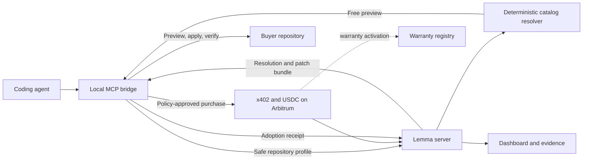

# Lemma

**Verified integration work for coding agents.**

Coding agents repeatedly solve the same integration problems, but copying an old implementation is not enough. The agent still needs to know whether that implementation fits the current repository, whether its dependencies are compatible, whether applying it is safe, and whether buying the result costs less than rebuilding it.

Lemma turns reviewed integration work into compatibility-aware releases. An agent can request a free preview, receive a deterministic reuse decision, purchase a matching resolution through x402, apply it locally, and record whether it passed the release's acceptance test.

Lemma is for teams that run coding agents and want reuse to be measurable, bounded, and inspectable instead of another source of generated code.

## The product model

- A **Capability Release** packages a narrow integration, its supported repository profiles, provenance, patch bundle, acceptance recipe, price, evidence, and warranty terms.
- A **Compatibility Resolution** binds one release to one task, repository profile, buyer, payment, and recoverable payload.
- An **Adoption Receipt** records whether the applied resolution passed, failed, or was abandoned. Verified outcomes can inform compatibility history and warranty settlement.

The code remains open. The paid product is the verified answer that a specific release applies here, together with a ready integration path and bounded recourse when an eligible failure is confirmed.

## How Lemma works



The bridge is the local authority boundary. It scans allowlisted metadata, holds buyer-side state, enforces spending policy, checks drift, applies patches atomically, and runs acceptance commands. Repository source and buyer credentials do not belong on the hosted server.

The server owns deterministic matching, recoverable resolution state, catalog and dashboard APIs, privacy-thresholded demand data, and the persistence seam that the paid path will wrap.

## Why Arbitrum

Lemma needs a cheap, programmable settlement layer because a resolution can cost less than a typical software subscription. Arbitrum Sepolia is the MVP network for three related actions:

1. x402 payment in USDC for a Compatibility Resolution.
2. Activation of a provider-funded warranty after settlement.
3. An evaluator-confirmed pass or refundable failure outcome.

The payment and warranty paths are not implemented yet. The repository already fixes the chain, asset, pricing rules, idempotency model, and role boundaries that those paths must follow. See [Economics](docs/economics.md) and [Protocol](docs/protocol.md).

## Build status

Lemma is an active MVP build. The compatibility path is substantially implemented; real payments and bonded warranties remain gated work.

| Area | Status |
| --- | --- |
| Shared schemas, canonical digests, pricing, spending policy, and read models | Implemented and tested |
| Catalog loader, integrity checks, fixtures, and deterministic resolver | Implemented with two preview-only skeleton releases |
| Free MCP preview and resolution recovery | Implemented |
| Server persistence, dashboard APIs, demand aggregation, and startup checks | Implemented |
| Local repository scan, drift detection, atomic apply, crash recovery, and adoption verification | Implemented |
| Dashboard views and production bundle checks | Implemented |
| Benchmark harness, evidence derivation, economic probe, and reporting | Implemented; final fixtures and measured runs remain |
| x402 facilitator, paid MCP tool, signer integration, and settlement reconciliation | Pending |
| Warranty registry, deployment scripts, and evaluator outcomes | Pending |
| Public deployment, verified releases, benchmark evidence, and pilot | Pending |

This status is deliberately narrower than the product vision. No mainnet safety, production custody, measured savings, deployed contract, or public revenue claim is made today.

## Quickstart

Requirements:

- Node.js 22 or newer
- npm 10 or newer
- Foundry for Solidity builds and tests
- Docker or another Compose-compatible runtime when testing Postgres

Install and run the repository checks:

```bash
npm ci
npm run verify
npm run catalog:check
npm run contracts:build
npm run contracts:test
```

`npm run verify` typechecks source and tests, runs Vitest, builds every TypeScript workspace, and validates the production web bundle. Some process-isolation tests require Linux facilities such as `/proc` and network namespaces.

Start the implemented applications in separate terminals:

```bash
npm run dev:server
npm run dev:web
npm run dev:bridge
```

The server uses an in-memory store when `DATABASE_URL` is absent. Copy `.env.example` to `.env` only when a workflow needs configured infrastructure. Never use the example database password outside local development.

## Repository map

```text
apps/bridge/        Local stdio MCP server and repository authority boundary
apps/server/        Hosted MCP endpoint, resolver APIs, persistence, and dashboard host
apps/web/           Read-only React dashboard
packages/core/      Versioned schemas, identifiers, pricing, policy, and read models
packages/catalog/   Curated releases, fixtures, resolver, and catalog integrity tools
packages/benchmark/ Controlled agent experiments and evidence derivation
contracts/          Foundry project for the pending warranty registry
docs/               Architecture, protocol, economics, security, and delivery decisions
ops/                Container and Railway configuration
```

Each workspace README explains how to develop that component. Start with the [documentation guide](docs/README.md) when changing behavior across more than one boundary.

## Roadmap to submission

The detailed go-or-iterate criteria live in [Economic Gates and Iterations](docs/economic-gates.md). The remaining path is:

1. Replace the skeleton catalog payloads with reviewed integration releases and run the economic probe.
2. Complete the x402 purchase path, idempotent settlement recovery, signer integration, and facilitator.
3. Implement and test the warranty registry, including one pass and one refunded failure on Arbitrum Sepolia.
4. Freeze and run the paired benchmark, publish measured evidence, and keep any failing profile preview-only.
5. Deploy the server, dashboard, database, and verified contract, then complete one public-repository pilot.
6. Publish the evidence bundle and record the final demo using only observed or clearly labeled testnet results.

## Documentation

- [Documentation guide](docs/README.md)
- [Architecture](docs/architecture.md)
- [Protocol](docs/protocol.md)
- [Economics](docs/economics.md)
- [Security policy](SECURITY.md)
- [Contributing](CONTRIBUTING.md)
