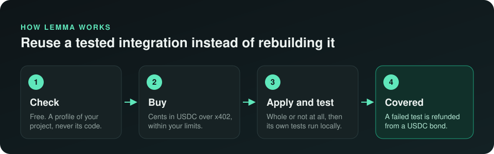
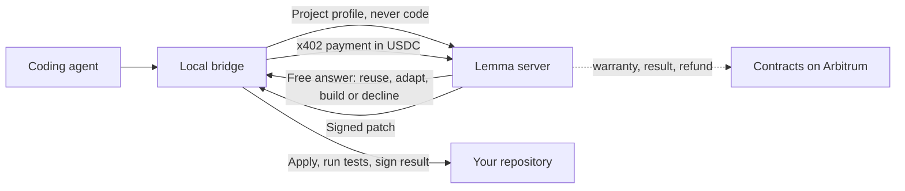

<div align="center">

<picture>
  <source media="(prefers-color-scheme: dark)" srcset="docs/brand/lemma-logo-dark.png">
  
</picture>

### Tested integrations your coding agent can reuse.

Before your agent writes an integration, it asks Lemma. If a tested patch fits your project, the agent buys it for cents over x402, applies it, and runs its tests. A failed test is refunded from a USDC bond.

**[Open Lemma](https://lemma-production-8383.up.railway.app)** · **[Connect your agent](https://lemma-production-8383.up.railway.app/#/connect)** · **[How it works](#how-lemma-works)** · **[Two purchases on chain](#two-purchases-every-step-on-chain)** · **[Run locally](#run-locally)**

`Arbitrum Sepolia 421614` · `x402` · `USDC` · `Stylus` · `MCP`



</div>

## Agents rebuild the same integrations

Coding agents solve the same integration problems again and again: x402 payment gating for an MCP server, a paying client with spending limits, a payment facilitator. Each rebuild costs model tokens and can still fail its tests.

Copying an old implementation is not enough. The agent needs to know whether it fits *this* repository, whether its dependencies match, whether applying it is safe, and whether buying it costs less than building it. Lemma answers all four, before any money moves.

## How Lemma works


```mermaid
flowchart LR
    A[Coding agent] --> B[Local bridge]
    B -->|Project profile, never code| C[Lemma server]
    C -->|Free answer: reuse, adapt, build or decline| B
    B -->|x402 payment in USDC| C
    C -->|Signed patch| B
    B -->|Apply, run tests, sign result| D[Your repository]
    C -. warranty, result, refund .-> E[Contracts on Arbitrum]
```

### Check: free, and private

**The agent sends a short profile of the project, never its source.** The local bridge reads allowlisted metadata (language, Node version, package manager, dependency versions) and Lemma's resolver answers `reuse`, `adapt`, `build` or `decline` with its reasons. Matching is deterministic: no model text reaches a match, a price or a payment. A project nothing fits gets a free answer to build it itself.

### Buy: cents in USDC, over x402

**A match comes with a price, and the agent pays it over x402.** The buyer key lives in a separate signer process (`lemma-signer`), never in the bridge or the agent. The signer checks the spending limits itself before it signs: a per-purchase cap, a daily cap, and the recipients it may pay. Lemma's own facilitator settles the payment, so the agent needs no ETH for gas.

### Apply and test: on your machine

**The patch goes in whole or not at all, then its own tests run.** The bridge refuses a patch over files that changed since it was built (it answers `adapt` instead), runs the release's acceptance tests as an argv array with no shell, and signs an adoption receipt with the result.

### Covered: a bond backs every sale

**The provider's USDC bond sits in a warranty contract and reserves the price of each sale.** A pass returns the reservation to the provider. A confirmed failure turns it into the buyer's credit, which the bridge claims with `lemma_claim_refund`. Each result also updates the release's score in a Stylus program, so anyone can check how often it passes.

## Two purchases, every step on chain

On 2026-10-01, an agent bought a test release twice on Arbitrum Sepolia (testnet), through the shipped bridge, signer and x402. One purchase passed its tests; the other failed and was refunded. Every step is a transaction you can open:

| Step | Purchase 1: passed | Purchase 2: refunded |
|---|---|---|
| Paid 0.25 testnet USDC over x402 | [`0x58792e54…e07693`](https://sepolia.arbiscan.io/tx/0x58792e541b6bb4024d93dc750c8cf2b84ee88a2c43f066b6e3e2f3a340e07693) | [`0xb6a9dd4d…d75b14`](https://sepolia.arbiscan.io/tx/0xb6a9dd4daa4e78c879194cd1c9b7a3ee73d36d04a36be3217e5007a6c4d75b14) |
| Warranty started from the bond | [`0x881b5bcf…5cf201`](https://sepolia.arbiscan.io/tx/0x881b5bcf18ca707e61f3e67419c33bc8d4e172b31627f002e0497d2b5b5cf201) | [`0xd4f2eb49…a665ce`](https://sepolia.arbiscan.io/tx/0xd4f2eb492ce8ac5e7bd88d6cffcb9ab0a8bd33816b031c1264a9c0d120a665ce) |
| Test result recorded on chain | [`0x08e34b4d…5a060a`](https://sepolia.arbiscan.io/tx/0x08e34b4db84c9e908accfce915d9bf1c5a1814ff0ffafb16031d364fb45a060a) (passed) | [`0xe2e4b36a…71efd0`](https://sepolia.arbiscan.io/tx/0xe2e4b36a88e71a7f7faf77a12aa3673f34141faa2502fc65b8d5ceed8971efd0) (failed) |
| Refunded 0.25 testnet USDC to the buyer | none: the tests passed | [`0x4d501efa…adf950`](https://sepolia.arbiscan.io/tx/0x4d501efa6df5390e81980ad5508d322eec602ddfbb06b97eaa1d00f69cadf950) |

Each purchase cost under 0.00002 testnet ETH in gas across all its transactions, and the buyer paid none of it. The release sold was a test release whose benchmark numbers were made up for the run; the payments, warranties, results and refund are real. The [deployment record](docs/deployments/arbitrum-sepolia.md) lists every transaction, the contracts, and what the run does and does not show.

| Contract on Arbitrum Sepolia | Address |
|---|---|
| Warranty registry (Solidity) | [`0x0B0FdF70AD27B3404Bd4C7f317f56c2388305F14`](https://sepolia.arbiscan.io/address/0x0B0FdF70AD27B3404Bd4C7f317f56c2388305F14) |
| Score engine (Stylus, Rust) | [`0x0ede0baf8b11b256fb1c3bfd678a2087188d44b6`](https://sepolia.arbiscan.io/address/0x0ede0baf8b11b256fb1c3bfd678a2087188d44b6) |
| USDC (Circle) | [`0x75faf114eafb1BDbe2F0316DF893fd58CE46AA4d`](https://sepolia.arbiscan.io/address/0x75faf114eafb1BDbe2F0316DF893fd58CE46AA4d) |

## Priced by what it saves

**A release may cost at most 30% of the saving a benchmark measured, and the buyer must still spend at least 25% less than building it.** Both rules are checked in code (`packages/core`), and money is integer USDC, never floating point. A release with no benchmark evidence can be previewed but never sold.

| Worked example | Amount |
|---|---:|
| Model cost for the agent to build it alone | 2.50 USDC |
| Saving with the patch, from the benchmark | 1.30 USDC |
| Highest price allowed (30% of the saving) | 0.39 USDC |
| Chain cost of the purchase | 0.01 USDC |
| **Cost with Lemma: 2.50 − 1.30 + 0.39 + 0.01** | **1.60 USDC, 36% cheaper** |
| **You keep: 1.30 − 0.39 − 0.01** | **0.90 USDC** |

The [Benchmark page](https://lemma-production-8383.up.railway.app/#/benchmark) has a calculator for these rules. See [Economics](docs/economics.md) and [Economic gates](docs/economic-gates.md).

## Connect your agent

The [Connect page](https://lemma-production-8383.up.railway.app/#/connect) installs the bridge in one click for **Cursor**, **VS Code** and **Goose**, with one command for **Claude Code** and **Codex**, and JSON for any other MCP agent. The server hosts the bridge as a single package with no dependencies:

```bash
claude mcp add -s local -t stdio -e LEMMA_API_URL=https://lemma-production-8383.up.railway.app lemma \
  -- npx -y https://lemma-production-8383.up.railway.app/dl/lemma-mcp-0.1.0.tgz
```

Checks are free and work straight away. Buying needs the signer (`npx -y -p <that package> lemma-signer init`) and your spending limits. The bridge's tools are `lemma_preview`, `lemma_apply_resolution`, `lemma_verify_adoption` and `lemma_claim_refund`, plus `lemma_buy_resolution` once a signer is running.

## Evidence you can inspect

- **Tests.** `npm run verify` typechecks sources and tests, runs over 1,000 Vitest tests across every workspace, builds everything and checks the production bundle. Foundry tests cover the warranty registry; Rust tests cover the Stylus engine, whose wasm rebuilds byte for byte (`npm run confidence:wasm:check`).
- **End to end on a local chain.** `npm run e2e` runs a full purchase, warranty, result and refund against the real contracts on anvil, with no network and no secret. CI runs it on every change.
- **On the real chain.** The [deployment record](docs/deployments/arbitrum-sepolia.md) of the 2026-10-01 run, and `npm run sepolia:check`, a read-only check of the contracts, their wiring and every score.
- **Benchmark harness.** [`packages/benchmark`](packages/benchmark) runs the same task with and without Lemma and derives evidence from the lower quartile of the paired savings, not the average ([protocol](docs/benchmark-protocol.md)).
- **Security.** [Security model](docs/security-model.md), [warranty registry review](docs/warranty-registry-review.md), and gitleaks over the full history in CI.

## Where it stands

| Works today | Next |
|---|---|
| Free preview, deterministic resolver, catalog integrity checks | Real releases with measured benchmark evidence ([draft #67](https://github.com/4waan/Lemma/pull/67) holds two x402 releases) |
| x402 purchase, buyer signer with spend limits, settlement, recovery | Public sales on the hosted server once a release has evidence |
| Warranty registry and Stylus score engine, deployed and used on Arbitrum Sepolia | Warranties on the hosted server, with a registry deployed for `main` |
| Hosted server and dashboard, one-click agent install | ERC-8004 reputation for the provider's agent |

Nothing here claims mainnet safety, production custody or measured savings yet. The purchases above are testnet, and the pricing table is a worked example, not a measurement.

## Run locally

Requires Node 22 and npm 10. Foundry runs the contract tests, Rust (rustup) the Stylus workspace, and Docker the Postgres tests.

```bash
git clone --recurse-submodules https://github.com/4waan/Lemma.git
cd Lemma
npm ci
npm run verify            # typecheck, test, build
npm run catalog:check     # catalog integrity
npm run contracts:test    # Foundry
npm run e2e               # full purchase on a local chain (Foundry)
```

Start the server, dashboard and bridge in separate terminals:

```bash
npm run dev:server        # http://localhost:3000, in-memory store without DATABASE_URL
npm run dev:web           # the dashboard, with hot reload
npm run dev:bridge        # the local MCP bridge
```

Copy `.env.example` to `.env` only when a workflow needs configured infrastructure, and never commit keys. To deploy, follow the [deployment runbook](docs/deployment.md).

## Repository map

| Path | Responsibility |
|---|---|
| [apps/bridge](apps/bridge) | Local MCP bridge: repository scan, spend policy, atomic apply, acceptance tests, and the buyer signer |
| [apps/server](apps/server) | Hosted MCP endpoint, resolver, x402 paid tool and facilitator, warranty pipeline, APIs, dashboard host |
| [apps/web](apps/web) | The dashboard |
| [packages/core](packages/core) | Versioned schemas, digests, amounts, pricing and policy |
| [packages/catalog](packages/catalog) | Releases, fixtures, resolver and catalog checks |
| [packages/benchmark](packages/benchmark) | Paired agent experiments and evidence |
| [packages/confidence](packages/confidence) | The score engine as reproducible wasm for the server |
| [contracts](contracts) | Warranty registry (Foundry), and the Stylus score engine in [contracts/stylus](contracts/stylus) |
| [e2e](e2e) | The full purchase on a local chain |
| [docs](docs) | [Architecture](docs/architecture.md), [protocol](docs/protocol.md), [reputation and confidence](docs/reputation-and-confidence.md), [deployment](docs/deployment.md), and the rest of the [documentation guide](docs/README.md) |
| [ops](ops) | Container, Railway configuration and Arbitrum Sepolia role setup |

## License

Lemma is released under the [MIT License](LICENSE). The skills under `.claude/skills/` keep their upstream licenses, recorded in [`.claude/skills/SOURCES.md`](.claude/skills/SOURCES.md); each catalog release declares its own SPDX license, and the contracts carry their own SPDX headers. See also [Security policy](SECURITY.md) and [Contributing](CONTRIBUTING.md).
